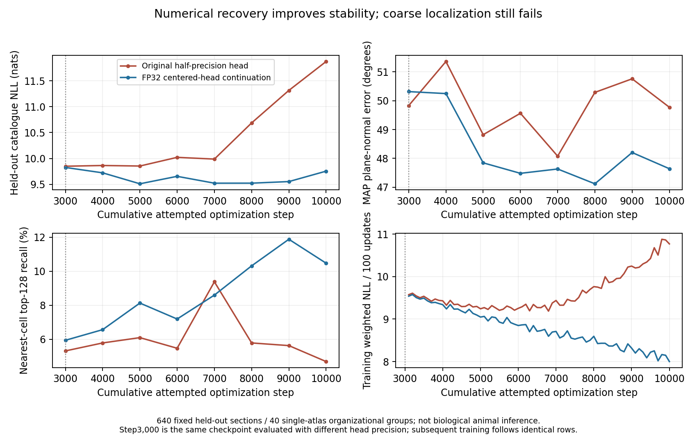

# Precision recovery 004: stable continuation, failed capture gate

Run 004 exited successfully at cumulative attempted step 10,000. The FP32,
centered probability head prevents the late numerical deterioration seen in
002, but its coarse localization remains inadequate. This does **not** qualify
the model for ordinary joint-refinement training, public benchmarking,
calibrated electrode probabilities, or deployment.

The comparison uses the same 640 held-out sections, unchanged training order and
the complete 98,304-cell catalogue. The saved `animal_macro` field means a macro
average across 40 **organizational synthetic groups from one Allen atlas**;
it is not biological animal-level generalization or population inference.

| Cumulative attempted step / computation | NLL, nats | MAP normal error, ° | Offset error, µm | Top-32 | Top-128 |
| --- | ---: | ---: | ---: | ---: | ---: |
| 3,000 / original 002 head | 9.851274 | 49.8294 | 2555.599 | 1.09375% | 5.3125% |
| 3,000 / corrected 004 head, same weights | 9.827773 | 50.3154 | 2608.737 | 2.03125% | 5.9375% |
| 10,000 / original 002 continuation | 11.871187 | 49.7721 | 2819.373 | 1.09375% | 4.6875% |
| 10,000 / corrected 004 continuation | 9.756497 | 47.6417 | 2785.166 | 3.4375% | 10.46875% |

The step-3,000 rows isolate the immediate inference change from subsequent
learning. All original frozen predictions remain unchanged. Relative to its
corrected start, 004 improves normal error by 2.67° and top-128 recall by 4.53
percentage points, but offset error **worsens** by 176µm. Its held-out NLL reaches
9.5127 at step 5,000 and ends at 9.7565 while training loss continues downward.
The final 100 training batches average weighted NLL 8.0000 versus 10.7711 in
002. Different training/development weighting precludes interpreting their
absolute difference as an exactly matched generalization gap. The curves are
consistent with remaining generalization limitations; precision was not the
only problem. This is one continuation, not a fresh corrected-model replication.

## Independent CPU audit

`training/audit_joint_v6_precision_recovery.py` recomputed all 16 saved complete
probability arrays at matching steps 3,000–10,000, including deterministic
catalogue-index tie handling and physical pose errors. No GPU/model replay was
used; the active curriculum output tree was not accessed.

- Recomputed per-row metrics match the saved rows exactly; the largest macro
  difference is 1.78e-7 from NLL accumulation precision. All raw log probabilities
  are finite. The largest absolute log-normalization error across both runs is
  2.607e-6; final 004 has 6.228e-7.
- Parent 002 step 3,000 and initial 004 have **exactly equal** model tensors,
  optimizer states, scaler, and CPU/CUDA/Python/NumPy RNG states. The complete row
  schedule is identical; the recorded driver continues `schedule[step-1]` for
  cumulative steps 3,001–10,000. Among shared training sources, only the proposal
  head changed. Hyperparameters, geometry, catalogue and cache manifests match.
- All 7,000 continuation attempts applied updates, with finite losses and
  gradients. Final optimizer state is step 10,000. Original 002 applied 9,997
  of 10,000 attempts, skipping 6,031, 7,279 and 9,284. Curves therefore match
  attempted cumulative steps, not perfectly equal applied-update counts.
- All checkpoint model tensors are finite. Exactly 34 tensors changed during
  recovery, confined to the histology stem, shared encoder and proposal head;
  combined change L2 is 41.49073454. Recurrent/deformation parameters remain
  untrained in this phase.
- Catalogue and prepared training/development files are byte-identical between
  runs and match recorded input receipts. Identities and row receipts match the
  original frozen caches; all five train/development identity intersections are
  empty. This preserves grouping, not independent biological anatomy.

## Frozen artifact receipts

Run: `I:/AnatomyTracker/runs/joint_v6_proposal_precision_recovery_004`.
Source commit: `31c2126e0b7a25138134392c0e2953329624294f`.
SHA-256 values below bind the principal 004 artifacts:

| Artifact | SHA-256 |
| --- | --- |
| `experiment.json` | `81e08fddc29f4d59169d54138c443c80344a94e24af60d2196c93891e2558e46` |
| `training_trace.jsonl` | `961605d6ecf3692313cd0bc9bcf77318834ca5ec39f6e34c85a66d71f3cc6340` |
| `training_row_indices.npy` | `9748f19bdbba652687a7198ffaa484912c5d7a54d6eb340ec5dacdc911ff02cb` |
| `joint_model_step_03000.pt` | `cdbd92b122e2ee3c3f71e4e10ce4a1d9f1d073b2a752fca916f53c318a29ed1f` |
| `joint_model_step_10000.pt` | `d040619543fbaf7c78a1e00fd9d07dbbc286a3320e270370c309e28257b14e23` |
| `development_log_probability_step_10000.npy` | `eebc70438f28d189b9345ba027e9fb865b4dcab71f45bc57b451fabf3b84759a` |
| `development_metrics_step_10000.json` | `7e702394d27f8d1c48f15c3bdd8993470fd931bf693cc938c361e8fd3dfef3f8` |

Full audit, including both runs' raw-array/row/identity/data hashes and all
recomputed support/mode subsets:
`I:/AnatomyTracker/runs/joint_v6_proposal_precision_audit_002_004/audit.json`,
SHA-256 `6665404040610c79d27c9d508f9638aacc40e6e523df2c1209c2ea826ace2033`.
Audit-script SHA-256:
`e5091c3853188ee778f30455efd0e5a852893f68c3e413770ac39a2133e470ab`.
